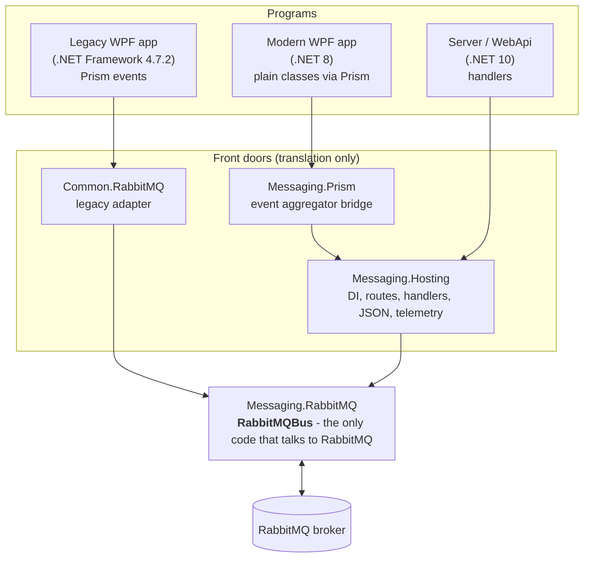
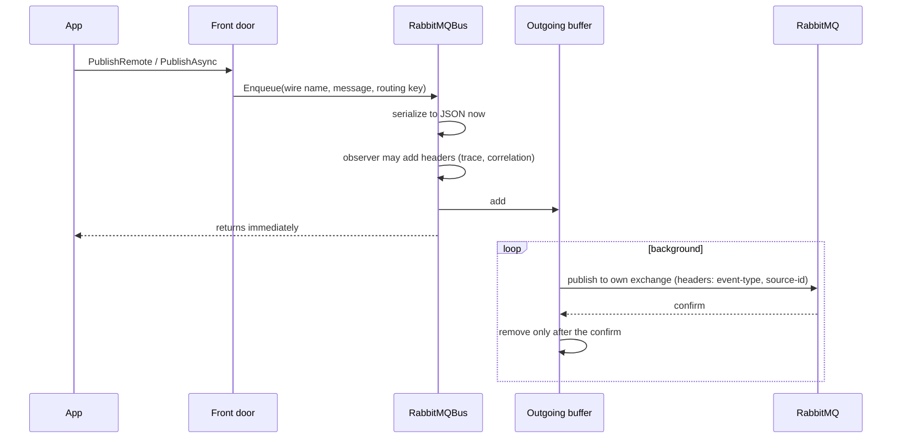
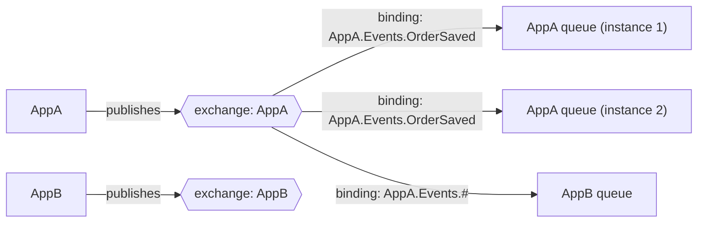

# RabbitMQ Messaging for WPF apps and the server

This repository lets separate programs send messages to each other through **RabbitMQ**. It covers old WPF desktop
apps (.NET Framework 4.7.2), new WPF apps (.NET 8) and an ASP.NET server (.NET 10). They all interoperate, and the
old apps need little or no code change.

This README is written so that **someone new to messaging can read it top to bottom and come out able to work on the
code confidently.** If you're in a hurry, read [the 5-minute version](#the-5-minute-version), then jump to the
[recipes](#recipes-how-to-use-it).

> **Rule for everyone:** every change to this repository must update this README in the same pull request, if the change
> affects anything described here. See [Keeping this README current](#keeping-this-readme-current).

---

## Contents

1. [The 5-minute version](#the-5-minute-version)
2. [Words you need (glossary)](#words-you-need-glossary)
3. [The big picture](#the-big-picture)
4. [What's in the repository](#whats-in-the-repository)
5. [How a message travels](#how-a-message-travels)
6. [Where messages go: exchanges, queues and bindings](#where-messages-go-exchanges-queues-and-bindings)
7. [When things go wrong: retries, dead letters and reconnecting](#when-things-go-wrong-retries-dead-letters-and-reconnecting)
8. [Recipes: how to use it](#recipes-how-to-use-it)
9. [Configuration reference](#configuration-reference)
10. [Running it on your machine](#running-it-on-your-machine)
11. [Tests](#tests)
12. [Continuous integration](#continuous-integration)
13. [Design decisions and known limits](#design-decisions-and-known-limits)
14. [Troubleshooting](#troubleshooting)
15. [Keeping this README current](#keeping-this-readme-current)

---

## The 5-minute version

- **RabbitMQ is a post office for programs.** A program hands it a message; RabbitMQ delivers copies to every program
  that asked for that kind of message. Sender and receivers never talk to each other directly and don't need to be
  running at the same time.
- **Every message has a name that says what it is**, for example `Common.Events.EmployeeUpdated`. This name is called
  the **wire name**. It's the one thing every program must agree on. Old and new code interoperate because they use
  the same wire names.
- **One engine does all the RabbitMQ work:** `RabbitMQBus` in `src/Messaging/Messaging.RabbitMQ`. It connects,
  reconnects, sends, receives, retries and dead-letters. Everything else in the repository is a thin "front door"
  that translates between how an app thinks and the engine:
  - **Old WPF apps** use Prism events: `eventAggregator.GetEvent<OrderSaved>().PublishRemote(order)`.
  - **New WPF apps** use plain classes, still through Prism: `GetEvent<MessageEvent<OrderSaved>>().PublishRemote(order)`.
    Or they use **no Prism at all**: `IMessagePublisher.PublishAsync(order)` and `IMessageSubscriber.Subscribe<OrderSaved>(...)`.
  - **The server** uses handlers: `IMessagePublisher.PublishAsync(order)` and `IMessageHandler<OrderSaved>`.
- **Sending is fire-and-forget.** A message is put in a buffer instantly and delivered in the background, even if
  RabbitMQ is briefly down.
- **Receiving has two modes.** Desktop apps each get their **own copy** of every message. Server instances **share
  the work**: each message goes to one of them, failures are retried, and messages that keep failing are parked in a
  **dead-letter queue** for a human to look at.
- **Everything is proven by tests against a real RabbitMQ**, locally and in CI, on both .NET Framework 4.7.2 and .NET 8.

---

## Words you need (glossary)

The whole system uses a post office analogy. Each term has the everyday picture first, then the precise meaning.

| Term | The everyday picture | What it precisely means here |
|---|---|---|
| **Broker** | The post office building. | The RabbitMQ server. Programs connect to it; it stores and forwards messages. |
| **Message** | A letter. | A small piece of data (JSON) plus a few labels (headers), for example "employee 7 was updated". |
| **Publish** | Posting a letter. | Handing a message to the broker. |
| **Subscribe / consume** | Getting letters delivered to your mailbox. | Asking the broker for messages and receiving them. |
| **Exchange** | A sorting desk. Each app owns one. | Where messages are published. It doesn't store anything; it copies each message to the queues whose bindings match. |
| **Queue** | A mailbox. | Where messages wait until a program takes them. |
| **Binding** | A forwarding rule: "copy letters labelled X from that desk into my mailbox". | A link from an exchange to a queue, with a pattern that says which messages to copy. |
| **Routing key** | The label on the envelope that the sorting desk reads. | A string sent with every message. Bindings match against it. It decides **where** a message goes. |
| **Wire name** | The form number printed inside the letter, like "Tax form 1040". | The message's identity, sent in the `event-type` header. It decides **what** a message is. Legacy events use their full .NET type name; new classes declare it with `[Message("...")]`. |
| **Header** | A sticky note on the envelope. | Extra named values sent with a message: `event-type`, `source-id`, and optionally `correlation-id` and `traceparent`. |
| **Exchange type** | How the sorting desk reads labels. | `topic` (patterns with `*` and `#`), `direct` (exact match), `fanout` (everyone gets everything), `headers` (match on headers, not the label). The default is `topic`. |
| **Acknowledge (ack)** | Signing for a delivery. | Telling the broker "I've handled this message, delete it." Until then the broker keeps it. |
| **Dead-letter queue** | The returns shelf. | A queue where messages that keep failing are parked instead of being lost. Named `<queue>.dead-letter`. |
| **Virtual host (vhost)** | A separate post office building. | An isolated compartment inside one broker. Apps in different vhosts can't see each other. The default is `/`. |
| **Per-instance queue** | A personal mailbox. | One private queue per running program. Every running copy gets every message. Deleted when the program exits. Used by desktop apps. |
| **Shared queue** | A team inbox. | One durable queue shared by all running copies of a service. Each message goes to one copy. Survives restarts. Used by servers. |
| **Quorum queue** | A team inbox with copies in several safes. | RabbitMQ's replicated, durable queue type. Shared queues use it. |
| **Echo** | Your own letter coming back to you. | A program receiving the message it just sent. Per-instance queues drop echoes automatically. |
| **Prism / event aggregator** | The internal intercom inside one app. | The desktop apps' in-process messaging (`IEventAggregator`). "Remote" messaging extends it across apps. |
| **Contract** | The agreed form layout. | A plain class describing a message's fields, e.g. `Employees.Contracts.EmployeeUpdated`. |
| **Handler** | The clerk who processes one kind of letter. | A server class `IMessageHandler<T>` that runs when a message of type `T` arrives. |
| **Serializer** | The typist who turns a form into text and back. | Converts a message object to JSON bytes and back. Legacy apps use Newtonsoft.Json; the server uses System.Text.Json set up to produce the same bytes. |
| **Observer / telemetry** | The post office's CCTV and logbook. | Optional tracing, metrics and logs of every send and receive (OpenTelemetry style). |

---

## The big picture



Two ideas explain almost everything:

1. **One engine, many front doors.** `RabbitMQBus` knows nothing about Prism, dependency injection or your business
   classes. It moves bytes reliably. The front doors translate "a Prism event" or "a message class with a handler"
   into "bytes with a wire name", and back.
2. **What vs. where.** The **wire name** (`event-type` header) says *what* a message is. The **routing key** says *where*
   it goes. Receivers always identify a message by its wire name, so routing can change freely without breaking anyone.

---

## What's in the repository

### Source (`src/`)

| Project | Target | Depends on | What it is | Who uses it |
|---|---|---|---|---|
| `Messaging/Messaging.Abstractions` | net472, netstandard2.0, net8.0 | nothing | Interfaces and small types: `IMessagePublisher`, `IMessageHandler<T>`, `[Message]`, `MessageContext`, `IMessageSerializer`, `IMessagingObserver`. | Everything below. |
| `Messaging/Messaging.RabbitMQ` | net472, netstandard2.0, net8.0 | RabbitMQ.Client 7.1.2 | **The engine**: `RabbitMQBus` and its options. | All front doors. |
| `Messaging/Messaging.Hosting` | net8.0 | Microsoft.Extensions 8.0 | Server-style setup: `AddMessaging`, routes, handlers, `IMessageSubscriber`, System.Text.Json, telemetry, health checks, `MessagingClient`. | The API, modern WPF apps. |
| `Messaging/Messaging.Prism` | net8.0 | Prism.Core, Messaging.Hosting | Optional bridge: plain message classes as Prism events (`MessageEvent<T>`). | Modern WPF apps that like the Prism style. |
| `Contracts/Employees.Contracts` | netstandard2.0 | Messaging.Abstractions | Plain message classes with legacy-compatible wire names. | The API, modern apps. |
| `Common.RabbitMQ` | net472, net8.0 | Prism.Core, Newtonsoft 12.0.3, the engine | **Legacy adapter.** Keeps the old API (`PublishRemote`, `RabbitMQService`, `IRabbitMQService`) working on top of the engine. Its public API is frozen: additions only. | Legacy WPF apps, the net8 app's Legacy bus. |
| `Common.RabbitMQ.Configuration` | net472, net8.0 | System.Configuration | The `<rabbitMQ>` App.config section. | Legacy and net8 WPF apps. |
| `Common.Events` | net472, net8.0 | Common.RabbitMQ | The demo apps' Prism events (`EmployeeUpdated` and others). | Demo WPF apps. |
| `WpfApp.Net472` | net472 | the above | Demo legacy desktop app. | You, to try things. |
| `WpfApp.Net8` | net8.0-windows | the above | Demo modern desktop app. It uses **both** styles side by side: Prism events on its Legacy bus, plain classes on its Modern bus. | You, and as the reference for migrating apps that keep Prism. |
| `WpfApp.Modern` | net8.0-windows | Hosting, Contracts, CommunityToolkit.Mvvm | Demo desktop app with **no Prism**: .NET Generic Host, `appsettings.json`, plain classes on both buses. | You, and as the reference for Prism-free apps. |
| `WebApi` | net10.0 | Hosting, Contracts | Demo server. No Prism, no Newtonsoft. | You, and as the reference server. |

### Tests (`tests/`)

| Folder | What it proves |
|---|---|
| `Common.RabbitMQ.Tests/Golden` | Message bodies are **byte-for-byte** what legacy apps expect (golden JSON files). |
| `Common.RabbitMQ.Tests/PublicApi` | The legacy adapter's public API has **nothing removed or changed**, only approved additions. |
| `Common.RabbitMQ.Tests/Broker` | The engine against a real broker: delivery, echo drop, headers, queues, retries, dead letters, observers. |
| `Common.RabbitMQ.Tests/Hosting` | The server side and modern clients: handlers, JSON, telemetry, health, routing keys, the Prism bridge, `IMessageSubscriber`. |
| `Common.RabbitMQ.Tests/LegacyModel` | A **model of the real legacy library** and every assumption about it, plus the new code working with it. |
| `Common.RabbitMQ.Tests/Adapter` | The legacy adapter's newer features: events by assembly, App.config, routing rules. |
| `Fixtures/Common.RabbitMQ.Baseline` | A **frozen copy** of the original library, so tests can prove old and new builds talk to each other. |
| `Fixtures/LegacyModel` | The legacy model and example event projects (`AppA.Events`, `AppB.Events`, `Shared.Events`). |

### Documents (`docs/`)

| Document | Read it when |
|---|---|
| [`adr/0001-decouple-messaging-from-prism.md`](docs/adr/0001-decouple-messaging-from-prism.md) | You want to know **why** the layers exist, and the compatibility rules. |
| [`adr/0002-exchange-per-owner-and-configurable-routing.md`](docs/adr/0002-exchange-per-owner-and-configurable-routing.md) | You want the topology: exchange per app, routing keys, events found by assembly, modern clients. |
| [`legacy-baseline-assumptions.md`](docs/legacy-baseline-assumptions.md) | You're checking this code against the real legacy library. |

---

## How a message travels

### Sending



In plain words:

1. Your code publishes. With the legacy style, `PublishRemote` also raises the event for subscribers **inside your
   own app** straight away.
2. The engine turns the message into JSON **immediately**, so later changes to your object don't change what's sent.
3. The message goes into an in-memory buffer and your code carries on. It never waits for the network.
4. A background loop sends buffered messages to your app's exchange. A message is removed from the buffer only
   when RabbitMQ confirms it has it. If RabbitMQ is down, messages wait and go out after reconnecting.

**The one thing to know:** if your **process crashes**, messages still in the buffer are lost. An "outbox" would
fix that; it's an optional future step (see [known limits](#design-decisions-and-known-limits)).

### Receiving

1. RabbitMQ puts a copy of the message in every queue whose binding matches its routing key.
2. The engine reads the headers. On a **per-instance** queue, a message whose `source-id` is this program is an
   echo and is skipped.
3. It finds the wire name in the `event-type` header (or, if missing, uses the routing key).
4. It looks up which .NET type that wire name means. If it doesn't know it, the message is skipped (per-instance),
   dead-lettered (shared, when it only binds known types), or skipped (shared, when it binds patterns).
5. It turns the JSON back into an object.
6. It hands the object to the **dispatcher**, the one step that differs per front door:
   - **Legacy:** `eventAggregator.GetEvent<TheEvent>().Publish(payload)`, so your normal Prism subscribers run.
   - **Server and modern apps:** each registered handler runs in its **own dependency-injection scope**, then every
     sink runs. The Prism bridge is a sink that raises `MessageEvent<T>`. `IMessageSubscriber` is a sink that calls
     the subscriptions for that message type.
7. It **settles** the message: acknowledges it on success. On failure, see [When things go wrong](#when-things-go-wrong-retries-dead-letters-and-reconnecting).

---

## Where messages go: exchanges, queues and bindings

### Exchange per application

Each application **owns one exchange**, named after it, and publishes only there. Another application that wants
those messages **binds its own queue** to that exchange.



- **Only the owner creates (declares) its exchange.** The new code never creates another app's exchange: it just
  checks that it exists, and if it doesn't (the owner hasn't started yet), it keeps retrying until it does.
- **Bindings decide what you receive:**
  - No keys given: one binding per message type your app knows, keyed by its wire name. This is how legacy apps work.
  - Patterns (topic exchanges): `orders.*.saved` (`*` = exactly one word), `AppA.Events.#` (`#` = any number of words).
  - Exact keys (direct exchanges), nothing (fanout), or header matches (headers exchanges).
- **Everyone uses the default virtual host `/`**, because apps can only bind to exchanges in their own vhost.

> The **demo apps** in this repository still use an older, simpler layout: one shared exchange per "bus"
> (`legacy.events`, `modern.events`) in two vhosts (`legacy`, `modern`). That's just the special case "own exchange
> = the shared exchange, subscribed to itself", so the same engine runs both layouts.

### Routing keys

- **Default:** the routing key is the wire name. Legacy apps rely on this.
- **Custom:** the publishing app may choose any key, for example `orders.eu.saved`, so subscribers can filter by
  region. The wire name still travels in the `event-type` header, so every receiver still knows what the message is.
- **The catch:** subscribers only receive messages whose key matches their bindings. Legacy apps bind wire names, so
  **custom keys don't reach legacy apps**. Keep the default key for anything legacy apps must receive.

### Two kinds of queue

| | Per-instance queue (desktop apps) | Shared queue (servers) |
|---|---|---|
| How many | One per running program | One per service, shared by all its running copies |
| Name | `clientname.busname.<random id>` | `clientname.busname`, plus `clientname.busname.dead-letter` |
| Lifetime | Deleted when the program exits | Durable: survives restarts; messages wait while nothing runs |
| Who gets a message | **Every** running copy | **One** running copy (the work is shared) |
| Your own messages | Dropped (no echo) | Handled like any other message |
| On failure | Acknowledged and dropped, as legacy apps always did | Retried, then dead-lettered |
| Setting | `QueueMode = PerInstance` (default) | `QueueMode = Shared` |

---

## When things go wrong: retries, dead letters and reconnecting

| Situation | What happens |
|---|---|
| RabbitMQ is down or the network drops | The engine keeps checking every `ReconnectDelay` (5 s by default) and reconnects on its own. Outgoing messages wait in the buffer. |
| Another app's exchange doesn't exist yet | Connecting fails with "Exchange 'X' does not exist yet; waiting for its owner to declare it" and retries until the owner starts. |
| A handler throws (per-instance queue) | Logged and acknowledged: the message is dropped. That's the legacy behaviour, kept on purpose. |
| A handler throws (shared queue) | Retried in the same process up to `MaxAttempts` times (3 by default), `RetryDelay` apart (1 s). Then it's moved to the dead-letter queue. |
| The message body isn't valid JSON (shared queue) | Straight to the dead-letter queue, with no retries, because retrying can't fix it. |
| A message keeps **crashing the whole process** | RabbitMQ counts deliveries lost with a connection. After `DeliveryLimit` (5) it dead-letters the message itself. |
| An observer (telemetry) throws | Logged and ignored. It never affects delivery. |

**Why retries happen in the process.** On RabbitMQ 4.x, a "put it back in the queue" rejection is **not counted**
towards the queue's delivery limit. We measured one failing message being redelivered over 6,000 times in 3 seconds.
So the engine counts attempts itself. The broker's delivery limit stays on only as a crash guard.

---

## Recipes: how to use it

### A. A legacy WPF app (.NET Framework 4.7.2, Prism events)

Your events stay exactly as they are: plain Prism events, no attributes, no special base class.

```csharp
public class OrderSaved : PubSubEvent<Order> { }
```

**1. Register the events assemblies, once, where the app starts:**

```csharp
RemoteEventRegistry registry = new RemoteEventRegistry()
    .Add(typeof(OrderSaved).Assembly)            // your app's events
    .Add(typeof(UserChanged).Assembly);          // shared events (netstandard2.0)

RabbitMQServiceRouter router = new RabbitMQServiceRouter(eventAggregator, registry);
foreach (RabbitMQConfig config in RabbitMQConfigLoader.Load())
{
    router.AddBus(config);
}

containerRegistry.RegisterInstance(router);
containerRegistry.RegisterInstance<IRabbitMQService>(router);
router.Init();                                   // connects in the background
```

**2. Configure App.config:**

```xml
<configSections>
  <section name="rabbitMQ" type="Common.RabbitMQ.Configuration.RabbitMQConfigSection, Common.RabbitMQ.Configuration" />
</configSections>

<rabbitMQ>
  <bus name="AppB" hostName="localhost" exchangeName="AppB" exchangeType="topic" clientName="AppB">
    <subscriptions>
      <subscribe exchange="AppA" />                                  <!-- every AppA event I know -->
      <subscribe exchange="AppC" routingKeys="orders.*.saved" />     <!-- by pattern -->
    </subscriptions>
    <routes>
      <route event="AppB.Events.CustomerChanged" routingKey="customers.eu.changed" />  <!-- optional default key -->
    </routes>
  </bus>
</rabbitMQ>
```

**3. Publish and subscribe, exactly as before:**

```csharp
eventAggregator.GetEvent<OrderSaved>().PublishRemote(order);                   // local subscribers + other apps
eventAggregator.GetEvent<OrderSaved>().PublishRemoteTo("orders.eu.saved", order); // with a custom routing key
eventAggregator.GetEvent<OrderSaved>().Subscribe(OnOrderSaved, ThreadOption.UIThread);
```

Older code that uses `RemotePubSubEvent<T>` with `[RemoteEvent("bus")]` keeps working unchanged.

### B. A modern WPF app (.NET 8, plain classes, Prism style)

**1. Write messages as plain classes with a wire name:**

```csharp
[Message("Common.Events.EmployeeSaved")]      // same wire name as the legacy event, so both sides interoperate
public class EmployeeSaved
{
    public int Id { get; set; }
    public string Name { get; set; }
}
```

**2. Start messaging and connect it to Prism** (see `src/WpfApp.Net8/App.xaml.cs`):

```csharp
MessagingClient client = MessagingClient.Create(services => services.AddMessaging(messaging => messaging
    .AddBus("Modern", options =>
    {
        options.HostName = "localhost";
        options.ExchangeName = "MyApp";
        options.ClientName = "MyApp";
    })
    .AddMessages(typeof(EmployeeSaved).Assembly)   // receive every [Message] class in it
    .Route<EmployeeSaved>().And()                  // publish it to the only bus
    .UseEventAggregator(eventAggregator)));        // raise received messages as MessageEvent<T>

containerRegistry.RegisterInstance(client);
containerRegistry.RegisterInstance(client.Publisher);
await client.StartAsync();                         // connects in the background
```

**3. Use it like any Prism event:**

```csharp
eventAggregator.GetEvent<MessageEvent<EmployeeSaved>>().Subscribe(OnSaved, ThreadOption.UIThread);
eventAggregator.GetEvent<MessageEvent<EmployeeSaved>>().PublishRemote(saved);
```

`PublishRemote` finds the publisher through Prism's container, just like the legacy version.

### C. A modern WPF app without Prism (.NET 8)

Use the same plain message classes as recipe B, but no Prism, no event aggregator and no DryIoc. See
`src/WpfApp.Modern`.

**1. Start the .NET Generic Host in `App.xaml.cs`.** It gives you DI, `appsettings.json` and logging, and starts
messaging:

```csharp
protected override async void OnStartup(StartupEventArgs e)
{
    base.OnStartup(e);
    HostApplicationBuilder builder = Host.CreateApplicationBuilder(new HostApplicationBuilderSettings
    {
        Args = e.Args,
        ContentRootPath = AppContext.BaseDirectory,       // find appsettings.json next to the exe
    });

    builder.Services.AddMessaging(messaging => messaging
        .AddBus("Modern", builder.Configuration.GetSection("Messaging:Buses:Modern"))
        .AddMessages(typeof(EmployeeSaved).Assembly)      // receive every [Message] class in it
        .Route<EmployeeSaved>().To("Modern"));
    builder.Services.AddSingleton<MainWindowViewModel>();
    builder.Services.AddSingleton<MainWindow>();

    host = builder.Build();
    MainWindow window = host.Services.GetRequiredService<MainWindow>();   // subscribe first...
    await host.StartAsync();                                               // ...then connect
    window.Show();
}
```

Stop it in `OnExit` with `Task.Run(() => host.StopAsync()).GetAwaiter().GetResult()`, so the UI thread can't deadlock.

**2. Send and receive in the view model:**

```csharp
public MainWindowViewModel(IMessagePublisher publisher, IMessageSubscriber subscriber)
{
    // Runs on the UI thread, like Prism's ThreadOption.UIThread.
    subscription = subscriber.Subscribe<EmployeeSaved>(OnSaved, SynchronizationContext.Current);
}

await publisher.PublishAsync(new EmployeeSaved { Id = 7, Name = "Ada" });
```

**Things to know about `IMessageSubscriber`:**

- A message type must be **received** for its subscribers to be called: add it with `AddMessages(assembly)` or a handler.
- `Subscribe` returns an `IDisposable`. **Dispose it to unsubscribe.** Subscriptions are strong references (Prism's
  are weak), so a window or view model that goes away before the app ends must dispose its subscriptions.
- **With a synchronization context** (the UI thread's), the call is posted to it and runs later. Its exceptions go to
  the dispatcher (`Application.DispatcherUnhandledException`), not to the message, so they don't cause retries.
- **Without one**, or with the async overload `Subscribe<T>((message, context, token) => ...)`, it runs on the
  receiving thread, and an exception fails the message (retried and dead-lettered on shared queues).
- Subscribers run after the handlers, in the order they subscribed, and only for the exact message type.

### D. A server (ASP.NET, handlers)

**1. Handlers are ordinary classes:**

```csharp
public class EmployeeSavedHandler : IMessageHandler<EmployeeSaved>
{
    public async Task Handle(EmployeeSaved message, MessageContext context, CancellationToken cancellationToken)
    {
        // runs in its own DI scope per message; throw to trigger retries (shared queues)
    }
}
```

**2. Wire it up in `Program.cs`** (see `src/WebApi/Program.cs`):

```csharp
builder.Services.AddMessaging(messaging => messaging
    .AddBus("Legacy", builder.Configuration.GetSection("Messaging:Buses:Legacy"))
    .AddBus("Modern", builder.Configuration.GetSection("Messaging:Buses:Modern"))
    .Route<EmployeeUpdated>().To("Legacy")                           // where to publish
    .Route<EmployeeCacheRefreshed>().To("Modern")
    .Handle<EmployeeUpdated, EmployeeUpdatedHandler>().From("Legacy") // what to handle, from where
    .Handle<EmployeeSaved, EmployeeSavedHandler>().From("Modern")
    .AddTelemetry());                                                // tracing, metrics, logs

builder.Services.AddHealthChecks().AddMessaging();
app.MapHealthChecks("/health");
```

**3. Publish from anywhere:**

```csharp
await publisher.PublishAsync(new EmployeeCacheRefreshed { ... });
await publisher.PublishAsync(order, new PublishOptions { RoutingKey = "orders.eu.saved" });
```

**More options:**

```csharp
messaging.Route<OrderSaved>().WithRoutingKey(o => $"orders.{o.Region}.saved");  // key from the message
messaging.Subscribe("AppA", "AppA.Events.#");                                    // another app's exchange
messaging.AddMessages(typeof(OrderSaved).Assembly);                              // receive without handlers
services.AddSingleton<IMessageSink, MySink>();                                   // see every message
using (CorrelationContext.Begin(requestId)) { ... }                              // correlation ID for published messages
```

Configuration mistakes stop the app at startup with a clear list of what's wrong, for example a route to a bus that
doesn't exist or a class without `[Message]`.

### E. Choosing between them

| You have | Use |
|---|---|
| An existing .NET Framework WPF app | Recipe A. Change one registration line and App.config, nothing else. |
| A migrated .NET 8 WPF app that keeps Prism | Recipe B. Plain classes, but the familiar Prism style. |
| A new .NET 8 WPF app, or one dropping Prism | Recipe C, like `WpfApp.Modern`. |
| A server, or code that should be free of Prism | Recipe D. |
| A .NET 8 app that must still talk to legacy apps | Both A and B side by side, like `WpfApp.Net8`. |

---

## Configuration reference

### Server and modern apps (`appsettings.json` → `Messaging:Buses:<name>`, or code)

| Setting | Default | Meaning |
|---|---|---|
| `HostName`, `Port` | `localhost`, `5672` | Where the broker is. |
| `VirtualHost` | `/` | The broker compartment. Apps that talk to each other must share it. |
| `UserName`, `Password` | `guest`, `guest` | Broker credentials. The default `guest` only works from the same machine as the broker. |
| `ExchangeName` | *(required)* | This app's own exchange. **Set it explicitly**: others bind to it by name. |
| `ExchangeType` | `topic` | `topic`, `direct`, `fanout` or `headers`. Keep `topic` while legacy apps subscribe to it. |
| `ExchangeDurable` | `true` | Whether the exchange survives a broker restart. |
| `BindOwnExchange` | `true` | Also receive this app's own message types from its own exchange (the legacy behaviour). |
| `Subscriptions` | *(none)* | Other apps' exchanges: `Exchange`, `RoutingKeys`, `HeaderMatch`, `MatchAllHeaders`. |
| `ClientName` | the app's name | Shown in the management UI, sent as app-id, used in queue names. |
| `QueueMode` | `PerInstance` | `PerInstance` (desktop) or `Shared` (servers). |
| `SharedQueueName` | `clientname.busname` | Shared queues only. |
| `MaxAttempts` | `3` | Shared queues only: handler attempts per message before dead-lettering. |
| `RetryDelay` | `00:00:01` | Shared queues only: the wait between attempts. |
| `DeliveryLimit` | `5` | Shared queues only: the crash guard (see above). |
| `ReconnectDelay` | `00:00:05` | How often to check the connection and retry. |
| `OutstandingPollInterval` | `00:00:00.1` | How often the outgoing buffer is checked when idle. |
| `PrefetchCount` | `50` | How many unacknowledged messages a queue may hand over at once. |
| `Heartbeat` | `00:00:30` | Connection keep-alive. |

Example (`src/WebApi/appsettings.json`):

```json
"Messaging": {
  "Buses": {
    "Legacy": { "HostName": "localhost", "VirtualHost": "legacy", "ExchangeName": "legacy.events",
                "ClientName": "WebApi", "QueueMode": "Shared" }
  }
}
```

### Legacy apps (`App.config` → `<rabbitMQ><bus ...>`)

| Attribute / element | Default | Meaning |
|---|---|---|
| `name` | *(required)* | The bus name, matched by `[RemoteEvent("name")]` or `RemoteEventRegistry.Add(assembly, "name")`. |
| `hostName`, `port`, `virtualHost` | `localhost`, `5672`, `/` | Where the broker is. |
| `userName`, `password` | `guest`, `guest` | Credentials. |
| `exchangeName` | *(required)* | This app's own exchange. |
| `exchangeType` | `topic` | As above. |
| `clientName` | the process name | As above. Set it: the process name includes `.exe`. |
| `reconnectDelaySeconds`, `outstandingPollIntervalMilliseconds`, `prefetchCount`, `heartbeatSeconds` | `5`, `100`, `50`, `30` | As above. |
| `<subscriptions><subscribe exchange="..." routingKeys="a, b" /></subscriptions>` | *(none)* | Other apps' exchanges. No `routingKeys` means one binding per known event. |
| `<routes><route event="Full.Name" routingKey="..." /></routes>` | *(none)* | A default routing key per event, used by `PublishRemote`. |

### Headers on the wire

| Header | Sent by | Meaning |
|---|---|---|
| `event-type` | always | The wire name: **what** the message is. Frozen. |
| `source-id` | always | Which running program sent it, for dropping echoes. Frozen. |
| `x-dotnet-pub-seq-no` | always, added by RabbitMQ.Client | Internal sequence number. Nobody reads it. |
| `correlation-id` | with `AddTelemetry()` | Groups related messages into one conversation. |
| `traceparent`, `tracestate` | with `AddTelemetry()` | Distributed tracing (W3C trace context). |

Receivers ignore headers they don't know, so new headers can always be added safely.

### Telemetry (servers)

- **ActivitySource and Meter name:** `Messaging` (`MessagingTelemetry.Name`). In OpenTelemetry, add both with
  `.AddSource("Messaging")` and `.AddMeter("Messaging")`.
- **Metrics:**
  - `messaging.client.sent.messages`
  - `messaging.client.consumed.messages`
  - `messaging.process.duration` (seconds)
- **Health check:** `messaging`, tagged `ready`. It's **Unhealthy** while any bus is disconnected, and reports how
  many messages each bus has buffered.

---

## Running it on your machine

### 1. Install RabbitMQ (once)

RabbitMQ runs on Erlang. The versions used here are Erlang/OTP **28.5.0.6** and RabbitMQ **4.3.6**.

```powershell
winget install --id Erlang.ErlangOTP --version 28.5.0.6 --exact
# RabbitMQ has no winget package: download rabbitmq-server-windows-4.3.6.zip from
# https://github.com/rabbitmq/rabbitmq-server/releases/tag/v4.3.6 and unzip it to %LOCALAPPDATA%\Programs
```

### 2. Start the broker

```powershell
$env:ERLANG_HOME = 'C:\Program Files\Erlang OTP'
& "$env:LOCALAPPDATA\Programs\rabbitmq_server-4.3.6\sbin\rabbitmq-server.bat"
```

To stop it: `rabbitmqctl.bat stop`, in the same `sbin` folder.

### 3. One-time broker setup for the demo apps

The demo apps use two vhosts, and the management UI is handy for watching messages:

```powershell
$sbin = "$env:LOCALAPPDATA\Programs\rabbitmq_server-4.3.6\sbin"
foreach ($v in 'legacy','modern') {
  & "$sbin\rabbitmqctl.bat" add_vhost $v
  & "$sbin\rabbitmqctl.bat" set_permissions -p $v guest '.*' '.*' '.*'
}
& "$sbin\rabbitmq-plugins.bat" enable rabbitmq_management     # then open http://localhost:15672 (guest / guest)
```

### 4. Build and run the demo

```powershell
dotnet build RabbitMQ.Refactor.sln
dotnet run --project src/WebApi --urls http://localhost:5199      # then open /health and /api/employees
src\WpfApp.Net472\bin\Debug\net472\WpfApp.Net472.exe               # start two of these
src\WpfApp.Net8\bin\Debug\net8.0-windows\WpfApp.Net8.exe
src\WpfApp.Modern\bin\Debug\net8.0-windows\WpfApp.Modern.exe      # the app without Prism
```

**Things to try:**

- **In a net472 window:** click *PublishRemote EmployeeUpdated (Legacy)*. The other windows and the API receive it.
- **In the net8 window:** click *PublishRemote EmployeeSaved (Modern)*. The API updates its cache and replies with
  `EmployeeCacheRefreshed`, which appears in the net8 window.
- **In the WpfApp.Modern window:** it has buttons for both buses and shows everything it receives. The net472 windows
  receive its `EmployeeUpdated` as their Prism event, although it uses no Prism at all.
- **From the API:** `curl -X POST http://localhost:5199/api/employees/7/legacy-update -H "Content-Type: application/json" -d "{\"name\":\"Ada\"}"`
- **Reconnecting:** in the management UI, close a connection and watch the app reconnect on its own.

---

## Tests

```powershell
$env:RABBITMQ_TESTS_REQUIRED = '1'      # fail, instead of skip, if no broker is reachable
dotnet test tests/Common.RabbitMQ.Tests
```

- **About 200 tests** run on **both** .NET Framework 4.7.2 and .NET 8. They include golden bytes, public API checks,
  a real broker, the legacy model, hosting and the Prism bridge.
- **Without a broker,** broker tests are **skipped**, unless `RABBITMQ_TESTS_REQUIRED=1`. The non-broker tests still run.
- **A different broker:** set `RABBITMQ_HOST`, `RABBITMQ_PORT`, `RABBITMQ_VHOST`, `RABBITMQ_USER`, `RABBITMQ_PASSWORD`.
- **Tests clean up after themselves.** Each uses uniquely named exchanges and queues and deletes them afterwards.

**The rules the tests enforce, and what to do when one fails:**

| Test area | If it fails, it means | Do |
|---|---|---|
| Golden files (`Golden/*.json`) | The bytes on the wire changed, which may break legacy apps. | Fix the code. **Never regenerate a golden file to make a test pass.** |
| Public API (`PublicApi`) | The legacy adapter's public API changed. | Removals and changes are not allowed. A new public member must be added to `ApprovedAdditions`, with a reason. |
| Legacy model (`LegacyModel`) | Behaviour differs from what we believe the real legacy library does. | Check `docs/legacy-baseline-assumptions.md`. Change the model, the document and the named test **together**. |
| Frozen baseline (`Fixtures/Common.RabbitMQ.Baseline`) | *(never edit this folder)* | It's the original library, kept as the reference. |

---

## Continuous integration

`.github/workflows/ci.yml` runs on every pull request to `main`, on every push to `main`, and on demand:

| Job | Runs on | Broker | What it checks |
|---|---|---|---|
| `linux` | Ubuntu | `rabbitmq:4.3.6` container | Tests on .NET 8. |
| `windows` | Windows | Erlang + RabbitMQ installed on the runner (downloads verified by SHA-256) | Builds the whole solution (WPF, net472, net10) and runs tests on **.NET Framework 4.7.2 and .NET 8**. |

Both jobs set `RABBITMQ_TESTS_REQUIRED=1`, so a broken broker setup fails the run instead of skipping tests. When a
job fails, its test results are uploaded as an artifact.

---

## Design decisions and known limits

The full reasoning is in the two ADRs. The short version:

- **Legacy apps must not need code changes.** Legacy adapter changes are additive only, and the wire format is frozen
  (golden tests, frozen baseline, public API test).
- **Each third-party dependency lives in exactly one layer.** Prism and Newtonsoft are only in the legacy adapter and
  the optional Prism bridge. RabbitMQ.Client is only in the engine. Contracts depend on nothing.
- **Versions are shared with the legacy apps:** RabbitMQ.Client 7.1.2, Prism.Core 8.1.97, Newtonsoft.Json 12.0.3,
  pinned in `Directory.Packages.props`. The Prism-free demo app adds CommunityToolkit.Mvvm 8.4.2 and
  Microsoft.Extensions.Hosting 8.0.1. `WpfApp.Net472` opts out of central package versions, as legacy apps do.
- **Every library that legacy apps load also targets net472**, so they never need extra "netstandard" files.

**Known limits:**

| Limit | Why | Workaround |
|---|---|---|
| Messages still in the outgoing buffer are lost if the process crashes. | Sending is fire-and-forget. | An outbox (optional, future). |
| Custom routing keys don't reach legacy apps. | Legacy apps bind exact wire names. | Use the default key for anything legacy apps must receive. |
| A non-`topic` exchange locks out legacy subscribers. | Legacy apps re-declare exchanges they subscribe to as `topic` (assumption A16). | Keep `topic` where legacy apps subscribe. |
| Running more than one API instance makes its in-memory cache drift. | A shared queue gives each message to one instance. | Use an external cache, or add per-instance delivery for cache handlers (not built yet). |
| The legacy model is based on assumptions. | The real legacy library isn't available to this repository. | Check `docs/legacy-baseline-assumptions.md` against the real library. |

---

## Troubleshooting

| Symptom | Likely cause | Fix |
|---|---|---|
| Tests show as **skipped** | No broker reachable. | Start RabbitMQ, or set `RABBITMQ_HOST`. Use `RABBITMQ_TESTS_REQUIRED=1` to make this an error. |
| Log: *Exchange 'X' does not exist yet; waiting for its owner* | The app that owns exchange X hasn't started. | Start the owner. The subscriber connects on its own afterwards. |
| Log: *PRECONDITION_FAILED ... inequivalent arg 'type'* | Two apps declared the same exchange with different types. | Make them agree. Usually that means keeping `topic`. |
| Log: *NOT_ALLOWED - vhost X not found* | The vhost doesn't exist. | Create it (see [broker setup](#3-one-time-broker-setup-for-the-demo-apps)) or use `/`. |
| An app receives nothing | No matching binding, or a different vhost. | In the management UI, check the queue's bindings and the vhost. Check the routing key the sender used. |
| Messages pile up in `*.dead-letter` | A handler keeps failing, or the body can't be read. | Read the message in the management UI (`x-first-death-reason` says why), fix the cause, then move it back. |
| `/health` is Unhealthy | A bus is disconnected. | The response lists which bus. Check the broker and the credentials. |
| A startup error: *Messaging is misconfigured* | A route or handler names an unknown bus, or a class has no `[Message]`. | The message lists every problem. Fix them in `AddMessaging`. |
| `PublishRemoteTo` throws *does not support routing keys* | A custom `IRabbitMQService` that doesn't implement `IRoutingKeyPublisher`. | Use `RabbitMQService` or `RabbitMQServiceRouter`, or implement the interface. |
| The build crashes with *OutOfMemoryException* or hangs | Stale MSBuild worker processes. | Run `dotnet build-server shutdown`, or build with `-nr:false`. |
| Git Bash turns a vhost of `/` into `C:/Program Files/Git/` | Git Bash path conversion. | Set such environment variables from PowerShell instead. |

---

## Keeping this README current

**This README is part of the code.** Any change that affects something described here must update this README in the
**same pull request**. That includes:

- a new or changed project, public API, option, default, header, queue or exchange behaviour;
- a new recipe step, configuration setting or known limit;
- changed commands, versions or test rules.

The pull request template has a checkbox for it, and the project instructions in `CLAUDE.md` say the same for AI
assistants. Keep the language simple: if a newcomer couldn't follow a sentence, rewrite it.
